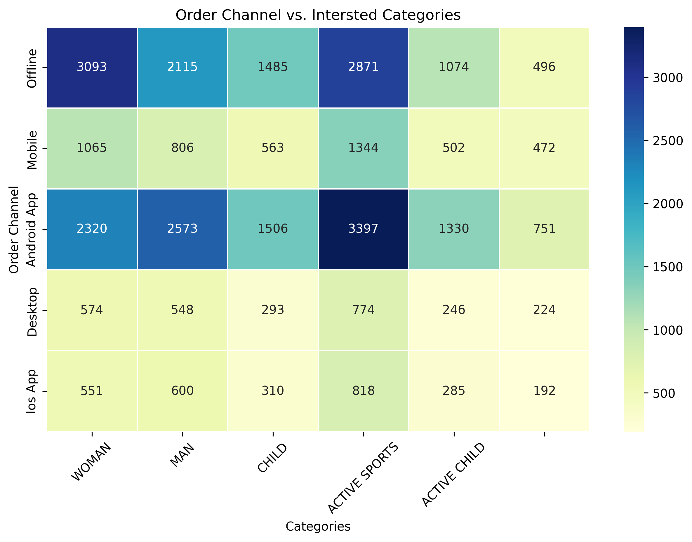
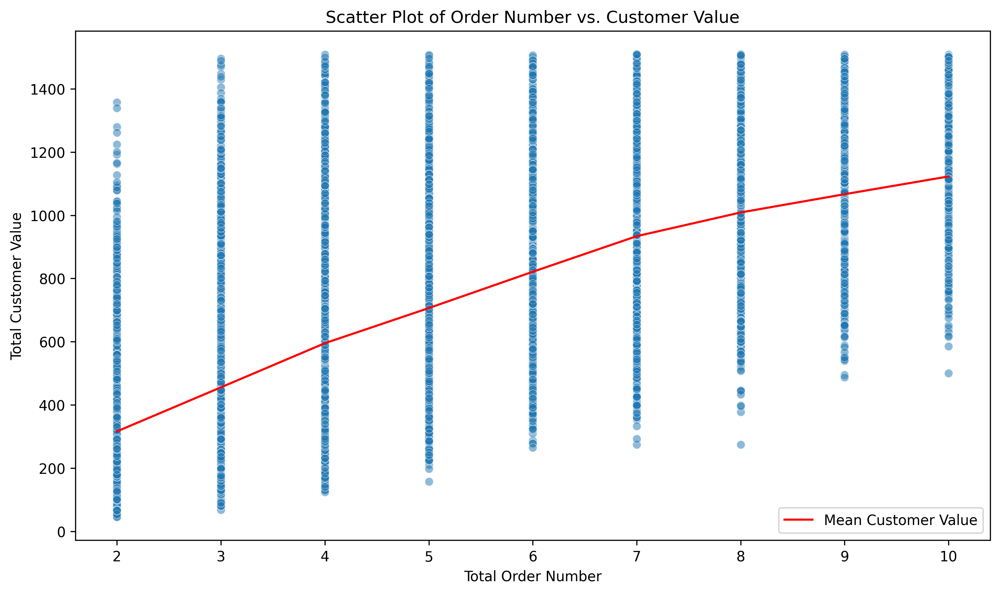
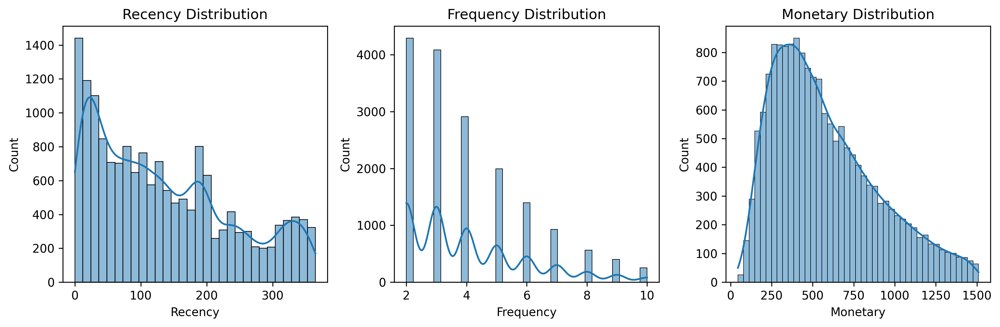
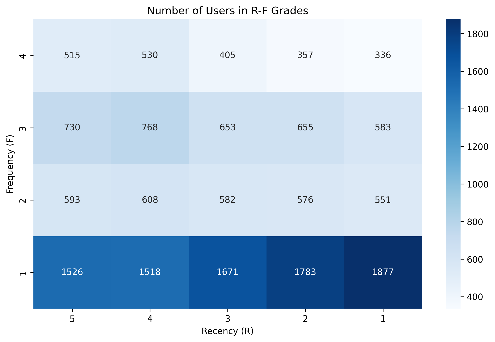

# **Customer Segmentation & CLTV Prediction for CRM Strategy (FLO E-commerce)**

**Author**: Sera Park  
**Contact**: sera.park.2026@anderson.ucla.edu  
**Dataset**: [Kaggle - flo-data-20k](https://www.kaggle.com/datasets/emrebilir/flo-data-20k-csv)

---

## **📌 Project Overview**

This project analyzes customer transaction data from FLO, a Turkish e-commerce platform, to extract insights for targeted CRM strategies.  
The focus is on customer segmentation and predicting **Customer Lifetime Value (CLTV)** for more efficient retention and marketing.

- **Goal**: Segment customers based on behavioral metrics and estimate future value.
- **Dataset**: 19,945 customers with online/offline orders, spending, and channel/category details.
- **Tools**: Python (Pandas, NumPy, Scikit-learn, Seaborn, Matplotlib), Jupyter Notebook

---

## **⚙️ Project Workflow**

### **1. Data Preparation & Feature Engineering**
- Combined online/offline metrics for total order count, value, and duration.
- Engineered categorical features (e.g., channel, category).
- Derived **RFM metrics** (Recency, Frequency, Monetary) for segmentation.

### **2. Exploratory Data Analysis (EDA)**
- Compared customer behavior across **channels, categories, and platforms**.
- Analyzed top purchasing trends, price ranges, and frequency patterns.

### **3. RFM Segmentation & Visualization**
- Created histograms to segment users by monetary value, recency, and frequency.
- Used `KMeans` clustering to define clear CRM customer groups.

### **4. CLTV Estimation**
- Computed expected CLTV using historical data and probabilistic models.
- Visualized and validated CLTV predictions to support retention strategies.

---

## **📊 Key Visualizations**

### **🧾 Order & Price Statistics**
 
 

---

### **📦 Channel & Category Analysis**
 

---

### **💳 Spending Distribution**
 
 
 

---

### **📈 Target Group Comparison**

---

### **📐 RFM & User Distribution**

 

---

### **🔍 CLTV Modeling**
 
 

---

### **🏆 Top Customer Profiles**
 
 
 
 

---

## **💡 Strategic Takeaways**

- **Online vs Offline Behavior**: Online channels dominate in recency and volume, suggesting stronger customer engagement.
- **Top Categories & Channels**: Segmentation by top-ordered categories shows clear channel preferences, guiding channel-specific promotions.
- **RFM Segmentation**: High-value customers are distinguishable by recency and monetary value—ideal for loyalty campaigns.
- **CLTV Prediction**: Top 10 CLTV customers identified—opportunity for VIP treatment, targeted marketing, and predictive retention strategies.

