# **Sera Park's Data Analytics Portfolio**

Welcome! I am **Sera Park**, an MSBA candidate at UCLA Anderson leveraging machine learning, statistical modeling, and data storytelling to solve real-world business problems.  
This portfolio highlights case-based analytics projects spanning predictive modeling, segmentation, quality control, and market analysis.

---

## **📁 Featured Projects**

### 🔍 [Fraud Detection Analysis](./fraud-detection)
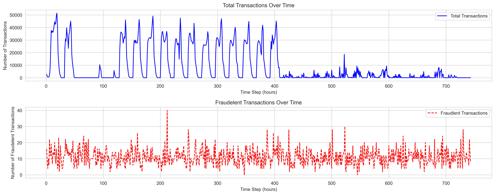

Built a Random Forest model to detect fraudulent transactions using EDA, imbalance-aware evaluation, and explainability.  
**Results (test):** Accuracy **1.00**, Precision(1) **0.98**, Recall(1) **0.78**, F1(1) **0.87**  
**Tools:** Python (Pandas, Scikit-learn, Seaborn, Matplotlib)  
> **Focus:** Fraud pattern discovery, anomaly detection, model interpretability

---

### 🛍️ [Customer Segmentation & CLTV Prediction](./CRM_analysis)
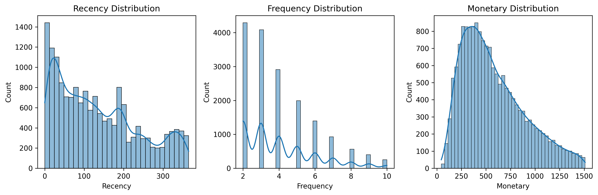

Segmented customers (KMeans=5) and estimated CLTV using BG/NBD + Gamma-Gamma to rank high-value cohorts.  
**Results:** CLTV-ranked top segments and personas for targeted CRM actions  
**Tools:** Python (Pandas, Scikit-learn), **lifetimes** (BG/NBD, Gamma-Gamma)  
> **Focus:** RFM/behavioral clustering, lifetime value modeling, campaign targeting

---
### 🛍️ [E-Commerce Funnel Analysis](./ecommerce-funnel-analysis)
Analyzed a cosmetics e-commerce funnel (View → Cart → Purchase) to measure drop-off and identify friction points using session-level event data.
**Results**: View→Cart 16.4%, Cart→Purchase 16.7%, View→Purchase 2.7% conversion rates
**Tools**: Python (Pandas, Matplotlib), Tableau
> **Focus**: Funnel optimization, session-based user journey mapping, behavioral conversion insights

---
### 📊 [E-Commerce Cohort & Retention Analysis](./ecommerce-cohort-analysis)
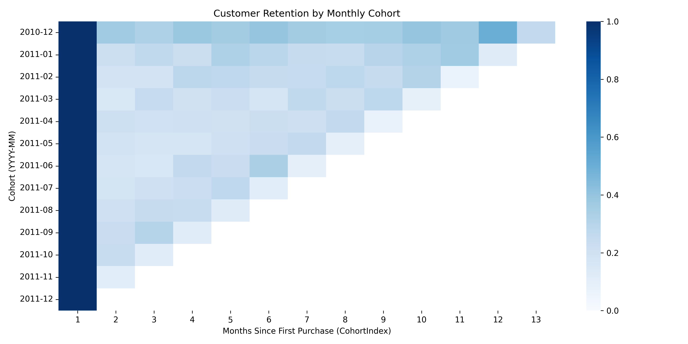

Analyzed e-commerce customer retention using cohort analysis and churn prediction modeling.  
**Results**: Retention dropped 50% within 2 months; Random Forest achieved 92% accuracy (ROC-AUC = 0.986) for next-month repurchase prediction.  
**Tools**: Python (Pandas, Seaborn, Scikit-learn)  
> **Focus**: Retention analytics, cohort-based behavior tracking, predictive churn modeling

---

### 🧺 [Market Basket Analysis (Association Rules)](./association-analysis)
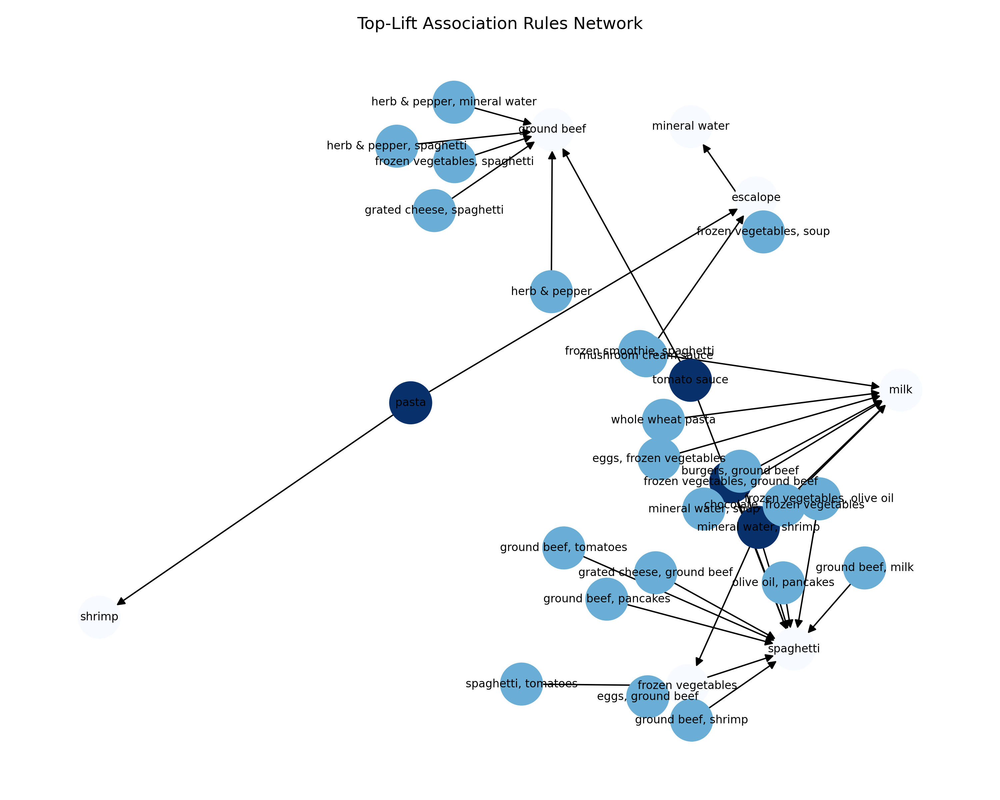

Discovered high-value co-purchase patterns from 7,500+ retail transactions using **Apriori** algorithm and association rule mining.  
Identified **high-lift product pairs** to inform targeted promotions, bundle design, and strategic in-store placement.

**Results:**  
- (mineral water) → (spaghetti) — **Lift 1.44**, Support 0.060, Confidence 0.251  
- (spaghetti) → (mineral water) — **Lift 1.44**, Support 0.060, Confidence 0.343  
- (mineral water) → (chocolate) — **Lift 1.35**, Support 0.053, Confidence 0.221  

**Tools:** Python (Pandas, mlxtend, Matplotlib, NetworkX)  
> **Focus:** Translating unsupervised learning insights into **actionable merchandising strategies** that can drive basket size growth and improve product placement efficiency.

---

### 📦 [Grocery Sales Demand Forecasting](./grocery-sales-forecast)
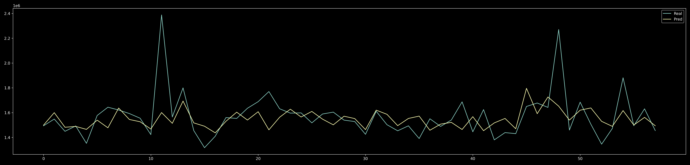

Forecasted weekly demand to inform inventory and staffing. Compared linear vs. tree-based regressors.  
**Results (test):** **MAE ≈ 95k–101k**, **R² ≈ 0.16–0.23** (baseline; feature/seasonality expansion planned)  
**Tools:** Python (Pandas, Scikit-learn, Matplotlib/Seaborn)  
> **Focus:** Feature engineering, model comparison, operations insights

---

### 🏭 [Quality Control Analysis (Wine)](./quality-control-analysis)
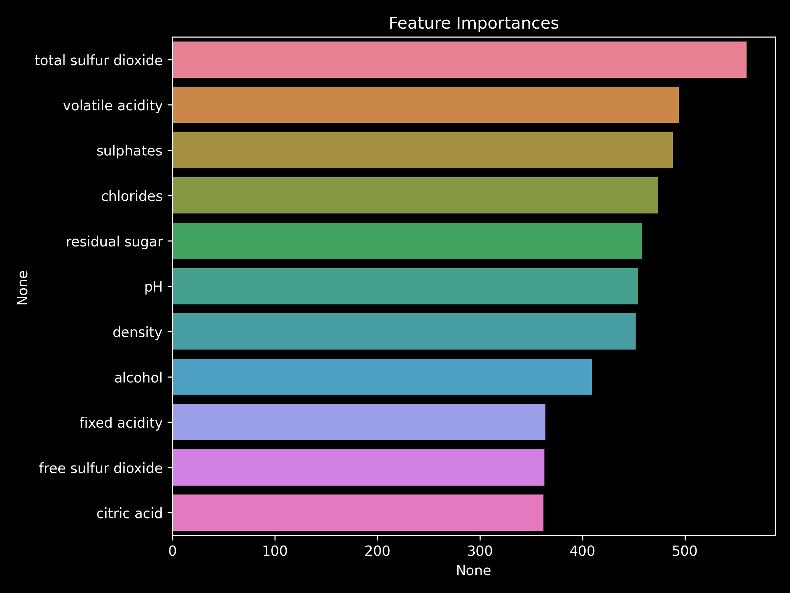

Identified drivers of ≥7 quality rating and quantified directional effects via interpretable regression.  
**Results:** **MAE(train/test)=0.57/0.58**, **R²(train/test)=0.28/0.27**; alcohol(+), volatile acidity(–), density(–)  
**Tools:** Python (Pandas, Scikit-learn, Seaborn, Matplotlib)  
> **Focus:** Process diagnostics, coefficient-based explainability, QC recommendations

---

### 💳 [Banking Subscription Prediction & Marketing Analysis](./banking-subscription-prediction)

Predicted term deposit subscription likelihood with Random Forest and hyperparameter tuning.  
**Results:** **Accuracy=0.6921** (GridSearch best); insights on duration/economic indicators  
**Tools:** Python (Pandas, Scikit-learn, Seaborn, Matplotlib)  
> **Focus:** Propensity modeling, class-level metrics, feature importance for targeting

---

### 🏬 [Card Transaction Analysis & Market Entry Fit](./card-transaction-analysis)
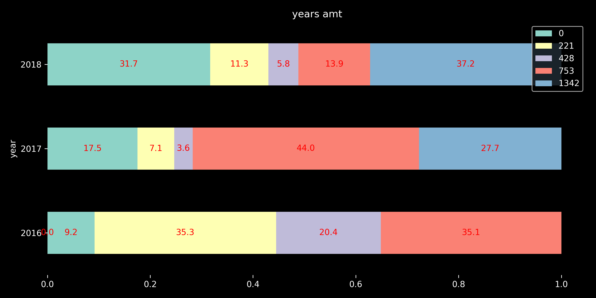

Profiled consumer behavior to assess district entry viability (core categories, weekend/holiday, installments, YoY shifts).  
**Results:** Weekend **30.9%**, Holiday **~4.4%**, Installments **~0.5%**; leadership mix shift (2017→2018)  
**Tools:** Python (Pandas, Seaborn, Matplotlib)  
> **Focus:** Decision-oriented EDA, category share tracking, entry strategy

---
### 📊 [Customer Segmentation (RFM Analysis)](./RFM-customer-segmentation)
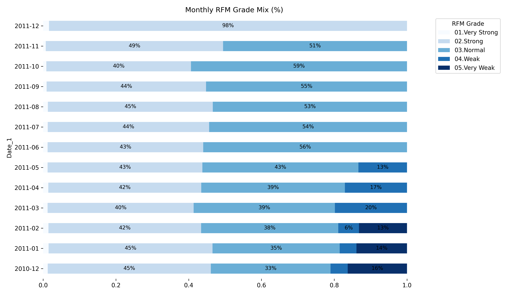

Segmented customers using **RFM metrics** to monitor high-value, at-risk, new, and low-value segments over time.  
Visualized **monthly distribution of RFM grades** to support data-driven marketing and retention planning.
**Results:**  
- High-value: Frequent, recent, high-spend → Loyalty focus  
- At-risk: Long time since last purchase → Re-engagement  
- New: Onboarding & repeat purchase  
- Low-value: Minimal spend → Limited marketing
**Tools:** Python (Pandas, Matplotlib, Seaborn)
> **Focus:** Translating RFM analysis into **actionable marketing strategies** with clear segment tracking.
---

### 🎮 [Abusive User Detection (Rule-based)](./game-abusive-user-analysis)
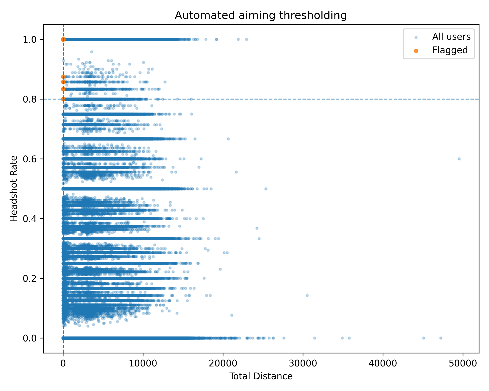

Flagged suspicious players using **statistical thresholds** on gameplay signals  
(e.g., low movement + high headshot rate, extreme kills with low heals).  
Summarized counts per rule and visualized key thresholds.
**Tools:** Python (Pandas, NumPy, Matplotlib, Seaborn)
> **Focus:** Translating heuristic thresholds (percentiles, mean±3σ) into a clear, auditable pipeline for abuse detection.

---

### 🏙️ [Airbnb Price Modeling (NYC)](./airbnb-value-analysis)
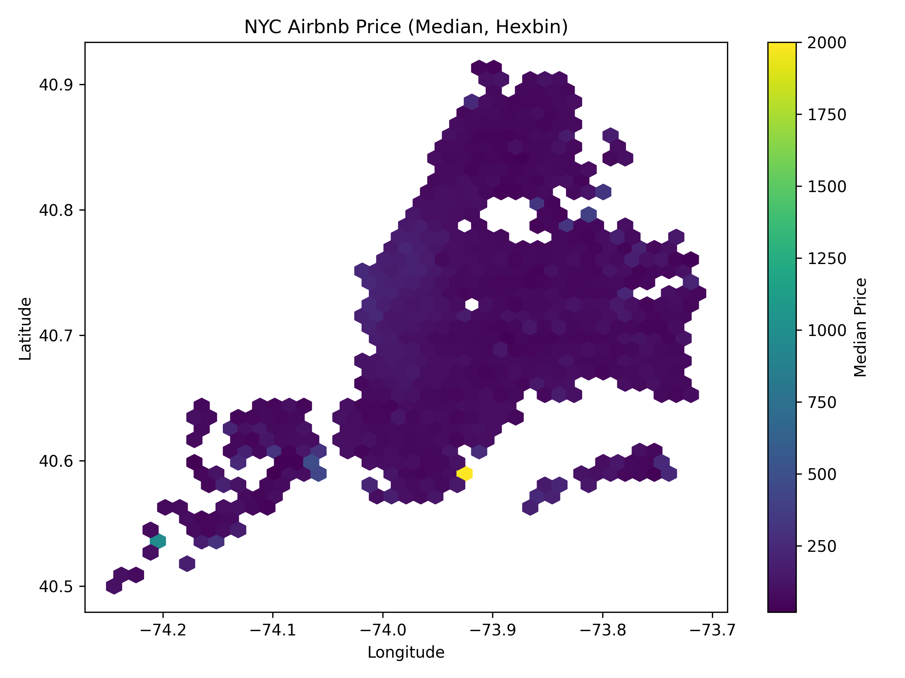

Built a **Random Forest regression** model to predict nightly prices and analyzed **value drivers**.  
After basic tuning, achieved **R²(test) ~ 0.16** (MAE ~ 67; RMSE ~ 176).  
Next steps include adding **geo-features** and **one-hot encoding** to improve accuracy.
**Tools:** Python (Pandas, Scikit-learn, Matplotlib, Seaborn)
> **Focus:** Turning model diagnostics into concrete feature-engineering plans (geo & encoding) to lift prediction quality.
---
### 🚗 [Car Insurance Fraud Prediction](./car-insurance-fraud)
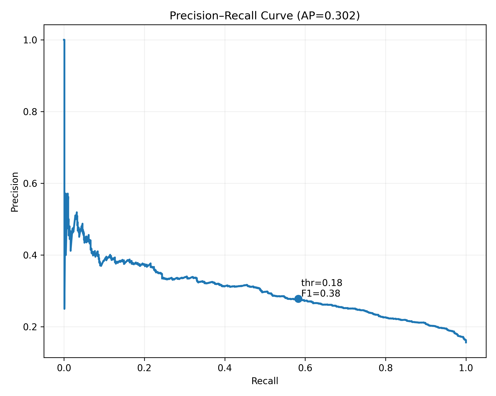

Built a LightGBM classifier to flag **fraudulent insurance claims** under class imbalance.  
From the notebook: **AUC(train)=0.7548**, **AUC(test)=0.7145**;  
on the test set, fraud recall is **0.17** at the reported operating point (accuracy **0.83**, macro F1 **0.57**).  
We use the **Precision–Recall curve** and **cumulative gain** to guide thresholding and top-k triage decisions.

**Tools:** Python (Pandas, scikit-learn, LightGBM, Matplotlib)
> **Focus:** Turning model diagnostics into **thresholding & investigator triage** with imbalance-aware evaluation.
---
### 🏨 [Hotel Booking Demand](./hotel-booking-demand)
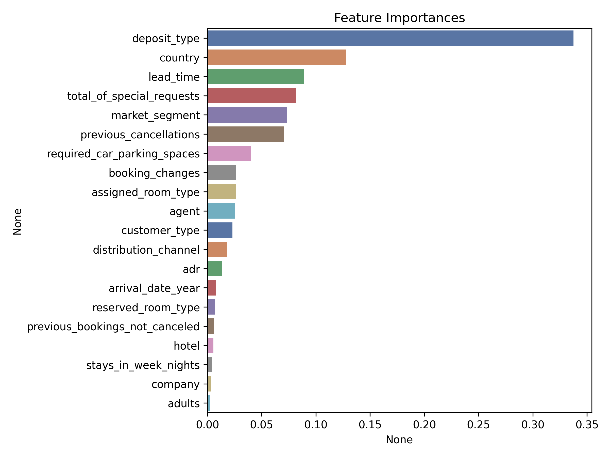

Built a Random Forest model to predict hotel reservation cancellations and no-shows using booking behavior features.  
**Results (test):** Accuracy **0.78**, Precision(1) **0.96**, Recall(1) **0.44**, F1(1) **0.60**  
**Tools:** Python (Pandas, Scikit-learn, Seaborn, Matplotlib)  
> **Focus:** Booking trend discovery, risk segmentation, predictive modeling
---

## 📫 Contact
📧 sera.park.2026@anderson.ucla.edu  
🔗 [**GitHub Portfolio**](https://github.com/serap1005/sera_park_portfolio)  
🔗 [LinkedIn](https://www.linkedin.com/in/sera-park-)
