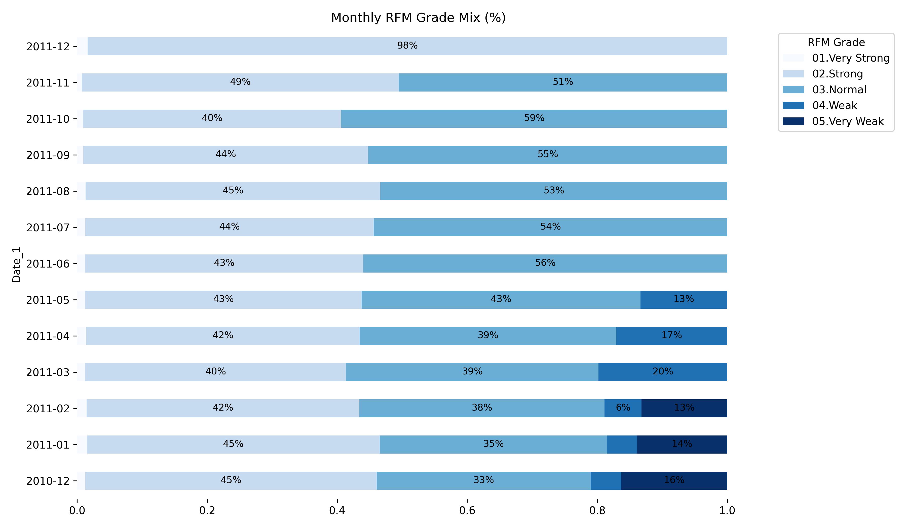

# Customer Segmentation (RFM Analysis)

## **Goal**
Segment customers using **RFM (Recency, Frequency, Monetary)** analysis to identify high-value, at-risk, new, and low-value customer groups, enabling targeted marketing and retention strategies.

---

## **Data & Method**
- **Dataset**: Historical retail transactions with Customer ID, Invoice Date, Quantity, Price
- **RFM Calculation**:
  - **Recency**: Days since last purchase
  - **Frequency**: Number of purchase events
  - **Monetary**: Total spend
- **Segmentation**: RFM grading & monthly distribution tracking
- **Visualization**: Monthly RFM grade mix (stacked barh)

---

## **Key Findings**
- High-value customers: Frequent purchases, recent activity, high spending → Focus on loyalty & upselling.
- At-risk customers: Long time since last purchase → Re-engagement campaigns.
- New customers: Low frequency, moderate spending → Onboarding & repeat purchase incentives.
- Low-value customers: Low on all metrics → Minimal marketing spend.

---

## **Business Impact**
- Enables **personalized marketing** instead of generic campaigns.
- Improves **ROI** by focusing on retention of profitable customers.
- Tracks **segment changes over time** to measure campaign effectiveness.

---

## **Tools**
Python (Pandas, Matplotlib, Seaborn)
