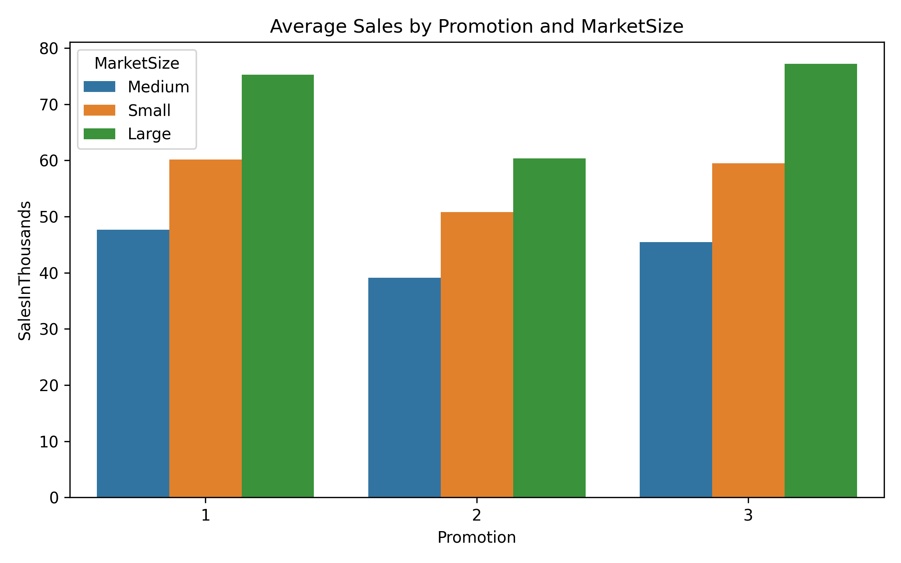

# Marketing A/B Test Analysis

## Project Overview
This project evaluates the effectiveness of different promotional campaigns (Promotion 1, 2, 3) in driving sales across fast-food markets.  
The analysis combines statistical testing (ANOVA, Tukey HSD) with machine learning (Random Forest) to understand both promotional and structural sales drivers.  

- **Goal:** Identify the most effective promotional strategy and provide actionable marketing recommendations.  
- **Data:** Fast-food marketing campaign A/B test dataset (Kaggle, 548 records × 7 features).  
- **Tools & Libraries:** Python (pandas, seaborn, matplotlib, scikit-learn, statsmodels), Jupyter Notebook.  

---

## Analysis Workflow

### 1. Data Import & Overview
- Loaded dataset with features: MarketID, MarketSize, LocationID, AgeOfStore, Promotion, Week, SalesInThousands.  
- Confirmed no missing values and balanced group representation (Promotion 1, 2, 3).  

### 2. Exploratory Data Analysis (EDA)
- **Sales Distribution by Promotion:**  
  Visualized distribution of sales for each promotion group.  
- **Weekly Trends:**  
  Compared weekly average sales trends across promotions.  
- **Promotion × Market Size:**  
  Analyzed how promotional performance differs across small, medium, and large markets.  

### 3. Statistical Validation
- **ANOVA:** Found significant differences among promotions (F=21.95, p < 0.0001).  
- **Tukey HSD Post-hoc:**  
  - Promotion 1 > Promotion 2 (**p < 0.001**)  
  - Promotion 3 > Promotion 2 (**p < 0.001**)  
  - Promotion 1 ≈ Promotion 3 (**p = 0.244**)  

➡️ **Promotion 2 underperforms consistently**. Promotions 1 and 3 yield similar results.  

### 4. Predictive Modeling
- **Model:** Random Forest Regressor (max_depth=6).  
- **Performance:** RMSE ≈ **6.0**.  
- **Feature Importance:** MarketSize and LocationID were the strongest predictors, while Promotion contributed less than structural market factors.  

---

## Key Insights
- **Promotion Effectiveness:** Promotion 2 is ineffective; Promotions 1 and 3 perform equivalently.  
- **Market Drivers:** Sales are more influenced by **market size and location** than by promotions alone.  
- **Strategic Implication:** Promotions amplify existing market potential rather than create new demand.  

---

## Key Visualizations

### Promotion Effectiveness
 

### Feature Importance

---
