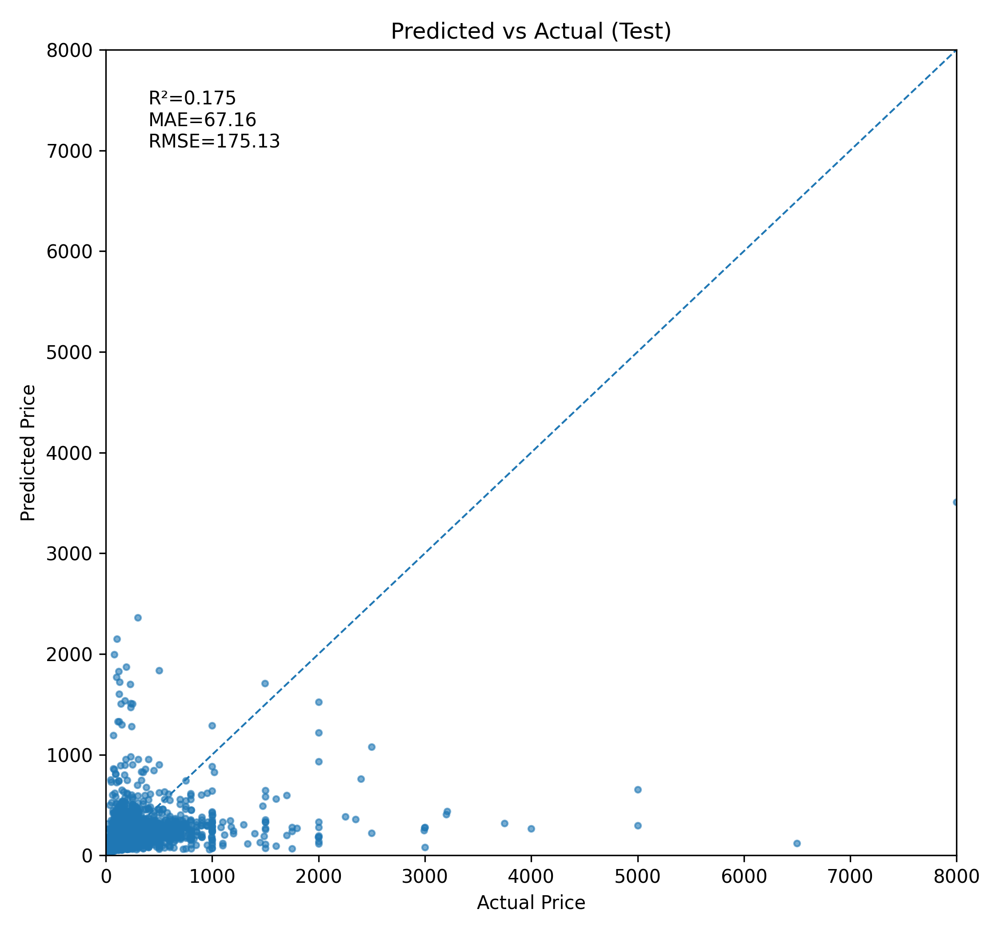

# Airbnb Price Modeling & Value Drivers (NYC)

## **Goal**
Predict nightly **price** for NYC Airbnb listings and identify key **value drivers** for pricing strategy.

## **Data & Method**
- 48,895 listings × 16 features (NYC Airbnb)
- Cleaning: `reviews_per_month` NA → 0
- Encoding: `neighbourhood_group`, `neighbourhood`, `room_type` (baseline: LabelEncoder; next: One-Hot)
- Modeling: `RandomForestRegressor` (+ basic Bayesian optimization)
- Metrics: R² / MAE / RMSE on **held-out test**

## **Results**
- Baseline RF: R²(test) ≈ **-0.004**
- Tuned RF (`max_depth=8, n_estimators=100`): R²(test) ≈ **0.164**, MAE ≈ **67.25**, RMSE ≈ **176.34**
- **Feature Importances** show location-related proxies dominate; adding geo-features is expected to improve performance.

## **Key Insights**
- Price is heavily **location-driven**. Incorporating `latitude/longitude` (or geohash/clustered coords) and using **One-Hot** for categories should materially lift accuracy.
- Consider **log(price)** target to stabilize variance.

## **Visuals**
- Predicted vs Actual (test) — model fit & error summary  
- *(Optional)* Geospatial hexbin of median price — spatial price gradient  
- Feature Importances (top 10)

## **Tools**
Python (Pandas, Scikit-learn, Matplotlib, Seaborn, bayes_opt)
