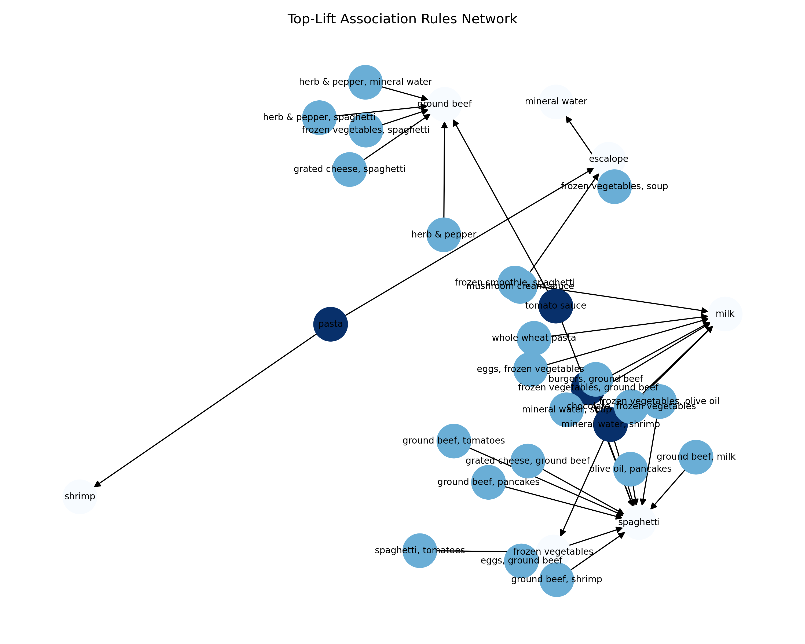

# Market Basket Analysis (Association Rules)

## **Goal**
Identify co-purchase patterns in retail transactions to inform **product placement**, **bundle promotions**, and **cross-sell strategies**.

---

## **Data & Method**
- **Dataset**: 7,501 transaction records (list-of-lists format)
- **Preprocessing**: TransactionEncoder → one-hot encoding
- **Modeling**: `mlxtend.apriori` with `min_support=0.005`, `max_len=3`
- **Evaluation**: `association_rules` to compute **support**, **confidence**, **lift**, **leverage**, **conviction**, **zhang's metric**

---

## **Key Findings**

- **Top frequent items**:
  1. Mineral water (~23.8%)
  2. Eggs (~18.0%)
  3. Spaghetti (~17.4%)

- **High-lift association rules**:
  - **(mineral water) → (spaghetti)**  
    Support ≈ 0.060, Confidence ≈ 0.251, Lift ≈ 1.44
  - **(spaghetti) → (mineral water)**  
    Support ≈ 0.060, Confidence ≈ 0.343, Lift ≈ 1.44
  - **(mineral water) → (chocolate)**  
    Support ≈ 0.053, Confidence ≈ 0.221, Lift ≈ 1.35

---

## **Business Impact**
- **End-cap pairing & bundle offers**:  
  Promote `{spaghetti, mineral water}` or `{mineral water, chocolate}` to increase basket size.
- **Merchandising insights**:  
  Position high-lift item pairs closer together in-store or feature them in joint promotions.

---

## **Network Visualization**

- **Node color**: Gradient by out-degree (number of rules originating from the node)
- **Interpretation**: Dense hubs like *mineral water* and *spaghetti* act as strong anchors for cross-sell strategies.

---

## **Tech Stack**
- Python (Pandas, mlxtend, Matplotlib, NetworkX)
- Jupyter Notebook
