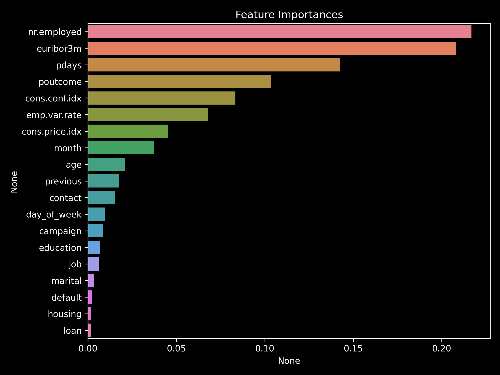

# **Banking Subscription Prediction & Target Marketing Analysis**

This project predicts client subscription likelihood for term deposit products and identifies high-potential segments for targeted marketing campaigns.  
It combines exploratory customer analysis with machine learning classification to optimize campaign ROI.

---

## **Business Problem**
Banks invest heavily in outbound marketing (e.g., phone calls) to promote term deposit products.  
**Challenge:** Low conversion rates lead to wasted marketing spend and customer fatigue.  
**Goal:** Build a predictive model to identify high-propensity customers, enabling efficient, targeted outreach.

**Potential Impact**
- Reduce wasted calls and operational cost
- Improve campaign conversion rates
- Focus resources on customers with the highest likelihood of subscribing

---

## **Data**
- **Source:** Bank marketing dataset (client demographics, contact info, macroeconomic indicators)
- **Target Variable:** `y` – whether the client subscribed to the term deposit (Yes/No)
- **Key Fields:** age, job, marital, education, default, housing, loan, contact, month, day_of_week, duration, campaign, pdays, previous, poutcome, emp.var.rate, cons.price.idx, cons.conf.idx, euribor3m, nr.employed

---

## **Methods**
1. **Exploratory Data Analysis** – categorical composition, subscription rate by segment, numerical distribution analysis  
2. **Feature Engineering** – encoding categorical variables, scaling numerical variables  
3. **Modeling** – RandomForestClassifier (baseline & tuned via GridSearchCV)  
4. **Evaluation** – Precision, Recall, F1-score, Accuracy (train/test)  
5. **Explainability** – Feature importance to understand drivers of subscription likelihood

---

## **Key Visuals**

---

## **Results**
- **Model:** Random Forest Classifier
- **Baseline Performance:**  
  - Train Accuracy: **1.00**, Test Accuracy: **0.90**  
  - Class 1 (Subscribed) – Precision: **0.57**, Recall: **0.30**, F1: **0.40**
- **Optimized Model (GridSearchCV, `max_depth=6`, `n_estimators=400`):**  
  - Accuracy: **0.6921**  
  - Improved generalization; reduced overfitting
- **Class-level Insights:**  
  - Students and retired clients show the highest average subscription rates (~11%)  
  - Duration of last contact, employment variation rate, euribor3m, and nr.employed are the most influential predictors

---

## **Business Recommendations**
- **Targeting:** Prioritize campaigns toward students and retired clients, especially those with recent or long-duration contacts  
- **Economic Timing:** Schedule outreach during favorable macroeconomic conditions (e.g., low unemployment, higher euribor3m rates)  
- **Campaign Design:** Shorten call lists to high-probability segments to reduce operational load and improve customer experience

---

## **Tech Stack**
**Python**: pandas, scikit-learn, matplotlib, seaborn  
**Models**: RandomForestClassifier  
**Metrics**: Precision, Recall, F1-score, Accuracy

