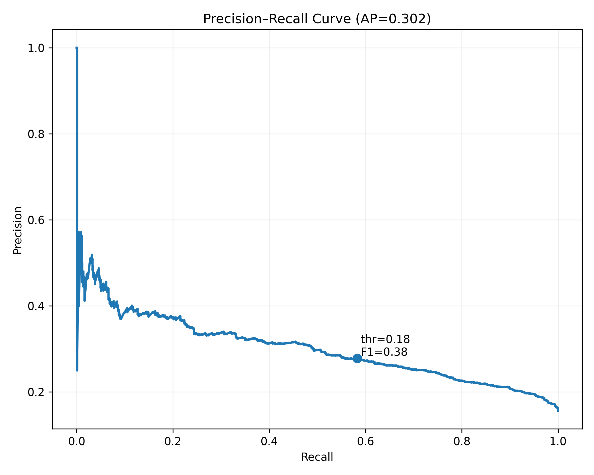

# Car Insurance Fraud Prediction

## **Goal**
Detect fraudulent car insurance claims using supervised learning under **class imbalance**, and choose an operating threshold via the **Precision–Recall curve** to balance recall and investigation cost.

---

## **Data & Features**
- Policyholder & claim attributes: driver/vehicle information, policy type, accident site, claim amount, etc.
- Preprocessing:
  - Missing values handled
  - Categorical variables encoded (baseline: LabelEncoder → next: One-Hot or LightGBM native categorical)

---

## **Model & Metrics**
- **Model**: LightGBM (depth=2, num_leaves=4, 500 iterations)  
- **Split**: Train/Test = 70/30

**Evaluation (printed from notebook):**
- **ROC AUC (train)** = **0.7548**  
- **ROC AUC (test)**  = **0.7145**
- **Classification report (test)**  
  - Class 0 (non-fraud): Precision **0.86**, Recall **0.95**, F1 **0.90** (support **4548**)  
  - Class 1 (fraud): Precision **0.40**, Recall **0.17**, F1 **0.24** (support **844**)  
  - **Accuracy** **0.83**, **Macro F1** **0.57**

> *Note.* The train classification report in the notebook shows:  
> class 0 (P=0.87, R=0.96, F1=0.91, support=10613), class 1 (P=0.48, R=0.20, F1=0.28, support=1968), accuracy=0.84, macro F1=0.59.

---

## **Threshold Selection**

- We select the operating point from the **Precision–Recall curve** (see figure) rather than a fixed default threshold, to raise fraud **recall** at a manageable precision.

---

## **Top-k Triage (Cumulative Gain)**

- The **cumulative gain** plot (test set) visualizes how many frauds are captured when investigators review only the top-ranked cases.  
- Use this to set review bandwidth (e.g., top 10/20/30% of claims) based on team capacity.

---

## **Key Insights**
- Baseline model under-detects positives at the default threshold; improving **recall** requires **threshold tuning** and **imbalance handling** (`is_unbalance=True` / `scale_pos_weight`).  
- Next steps:
  - Cost-sensitive evaluation (optimize expected savings)  
  - Better categorical treatment (One-Hot or LightGBM native)  
  - Feature engineering (policy tenure, prior claims history)

---

## **Tools**
Python (Pandas, scikit-learn, LightGBM, Matplotlib)
