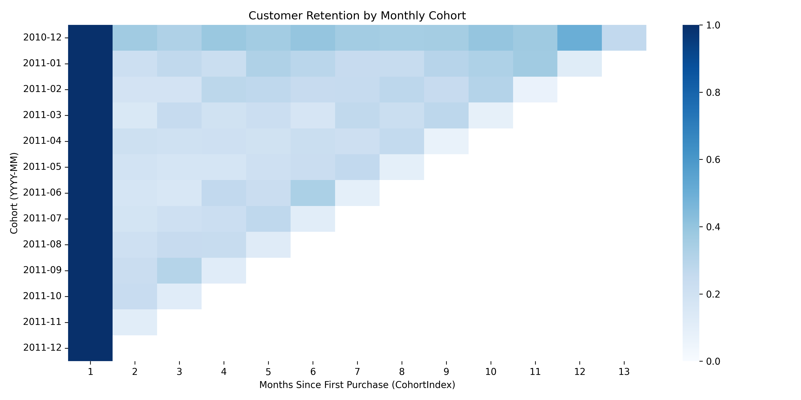
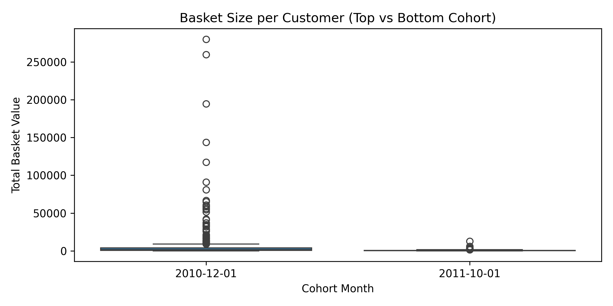

# 🛒 E-Commerce Cohort & Retention Analysis

## 📌 Project Overview
This project analyzes customer retention and repurchase behavior using cohort analysis and predictive modeling.  
The goal is to understand **when and why customers churn**, and to build a **machine learning model** to predict next-month purchases for targeted CRM strategies.

- **Dataset:** [Kaggle E-Commerce Data](https://www.kaggle.com/datasets/carrie1/ecommerce-data)  
- **Tools:** Python (Pandas, Numpy, Matplotlib, Seaborn, Scikit-learn)  
- **Techniques:** Cohort Analysis, Retention/Churn Metrics, Random Forest Classification  

---

## 🎯 Objectives
1. Identify cohort-level retention and churn trends.  
2. Visualize customer behavior over time (retention heatmaps, revenue trajectories, etc.).  
3. Build a predictive model to estimate next-month repurchase likelihood.  
4. Provide actionable insights for **retention and CRM strategy**.

---

## 🔑 Key Results
- **Retention drops by 50% within 2 months** across all cohorts.  
- A small loyal segment emerges after Month 6, stabilizing retention.  
- **High-performing cohorts** (e.g., Dec 2010) retained over 30% at Month 3, while the weakest (Oct 2011) fell below 12%.  
- **Random Forest model** achieved **92% accuracy, ROC-AUC = 0.986**, with `Tenure` and `Consecutive Purchases` as top predictors.  
- These results enable **early churn detection** and **targeted re-engagement campaigns**.

---

## 📊 Visualizations

### 1. Retention Heatmap

### 2. Cohort Revenue Trajectories

### 3. Average Churn Curve

### 4. Top vs Bottom Cohort Basket Value

### 5. Random Forest Feature Importance

---

## 📈 Process Workflow
1. **Data Cleaning & Preparation**  
   - Removed cancellations/negative values, converted dates  
   - Defined cohort groups and CohortIndex  

2. **Cohort Analysis**  
   - Retention & churn rate calculation  
   - Cohort-level revenue trends  
   - Top vs bottom cohort comparison (country, basket value)  

3. **Machine Learning (Churn Prediction)**  
   - Built customer-month panel  
   - Engineered features: Lag purchases, tenure, consecutive purchases, etc.  
   - Random Forest classification (ROC-AUC = 0.986)  

4. **Business Insights**  
   - Retention depends strongly on early engagement (first 2 months).  
   - Sustained consecutive purchases are the strongest indicator of loyalty.  
   - Predictive scoring enables proactive retention campaigns.  

---

## 💡 Business Impact
- Enables **targeted CRM campaigns**: identify at-risk customers before they churn.  
- Focuses marketing budget on **high-value loyal customers**.  
- Provides data-driven evidence for **onboarding improvements and re-engagement timing**.  

---
