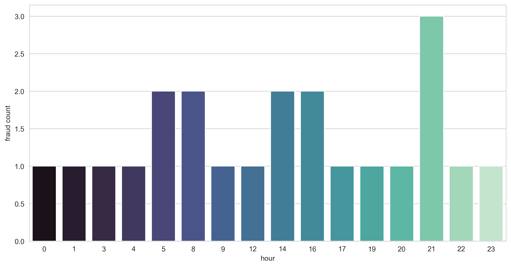

# Fraud Detection Analysis

## Project Overview
This project focuses on detecting fraudulent financial transactions using machine learning.  
The analysis includes data exploration, feature engineering, multicollinearity checks, and model interpretation to build a reliable fraud detection system.

- Goal: Identify fraudulent transactions and reduce false positives in financial systems.  
- Data: Anonymized transactional dataset with multiple features (amount, transaction type, time, etc.).  
- Tools & Libraries: Python (pandas, numpy, scikit-learn, matplotlib, seaborn), Jupyter Notebook.  

---

## Analysis Workflow

### 1. Data Import & Overview
- Loaded anonymized transaction dataset, reviewed feature distributions, and identified data types.
- Evaluated potential multicollinearity among features to prevent redundancy in modeling.

### 2. Exploratory Data Analysis (EDA)
- **By Transaction Type:**  
  Analyzed fraud rates across different transaction types (e.g., TRANSFER, CASH_OUT).
- **By Amount Segmentation:**  
  Examined transaction amount distributions (log-transformed for normalization) and their relationship with fraud likelihood.
- **By Time Trend:**  
  Investigated fraud occurrence patterns over time and by hour of day.

### 3. Feature Importance
- **Statistical Tests:**  
  Conducted T-tests and Chi-squared tests to determine statistically significant features.
- **Permutation Importance:**  
  Assessed feature importance using model-based permutation techniques to understand their predictive power.

### 4. Model Evaluation
- Built baseline models and evaluated performance using a confusion matrix and classification metrics.

---

## Key Insights
- Fraudulent transactions were most common in specific transaction types (e.g., TRANSFER and CASH_OUT).  
- Log-transformed amounts revealed clearer thresholds for distinguishing fraudulent behavior.  
- Certain balance differences (origin/destination) were strong indicators of fraud.  
- Statistical tests and permutation importance highlighted features most correlated with fraud likelihood.  

---

## Key Visualizations

### Transaction Analysis
 
 

### Balance & Time Trends
 
 

### Feature Analysis & Model
 
 

---

Author: Sera Park  
Contact: sera.park.2026@anderson.ucla.edu  
