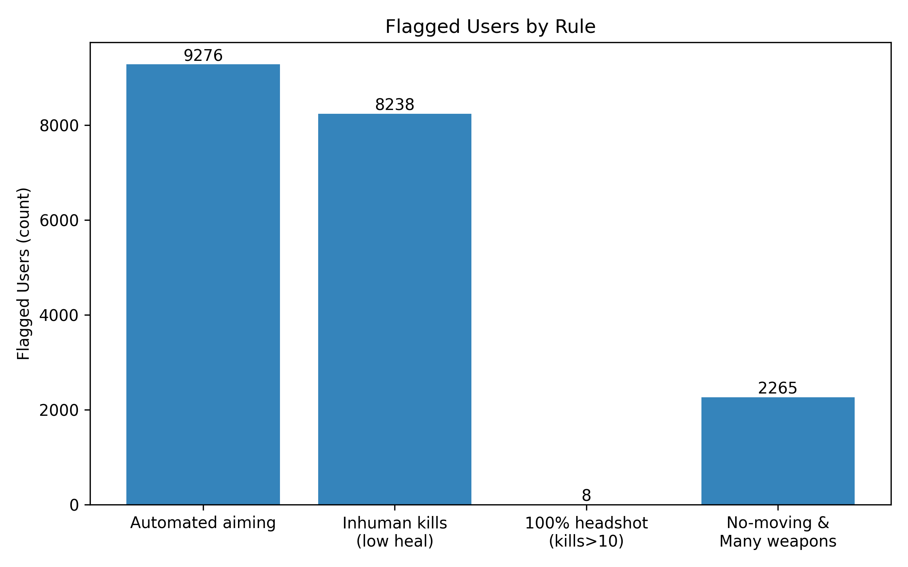

# Abusive Game User Detection (Rule-based)

## **Goal**
Detect **abusive players** from gameplay logs using **statistical thresholds** and **rule-based heuristics** (percentiles, z-scores).

## **Data & Features**
- Match/user-level logs: distance traveled, kills, headshot kills, heals, weapons acquired, win rate, etc.
- Engineered:
  - `_totalDistance = rideDistance + walkDistance + swimDistance`
  - `_headshot_rate = headshotKills / kills` (NA→0)

## **Rules**
1. **Automated aiming**: `_totalDistance ≤ P10` & `_headshot_rate ≥ 0.8`
2. **Inhuman kills**: `heals ≤ P10` & `kills ≥ mean + 3·std`
3. **100% headshot**: `_headshot_rate == 1` & `kills > 10`
4. **No-moving & many weapons**: `_totalDistance ≤ P10` & `weaponsAcquired ≥ P90`

## **Results**
- See **Flagged Users by Rule** for counts per rule.
- Sample records are inspected per rule to verify plausibility.

## **Visuals**
- Flagged users by rule (overview)
- Automated aiming threshold scatter *(optional)*

## **Tools**
Python (Pandas, NumPy, Matplotlib, Seaborn)
