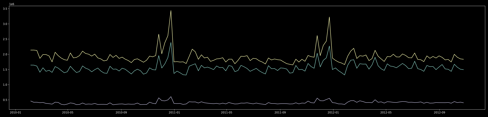
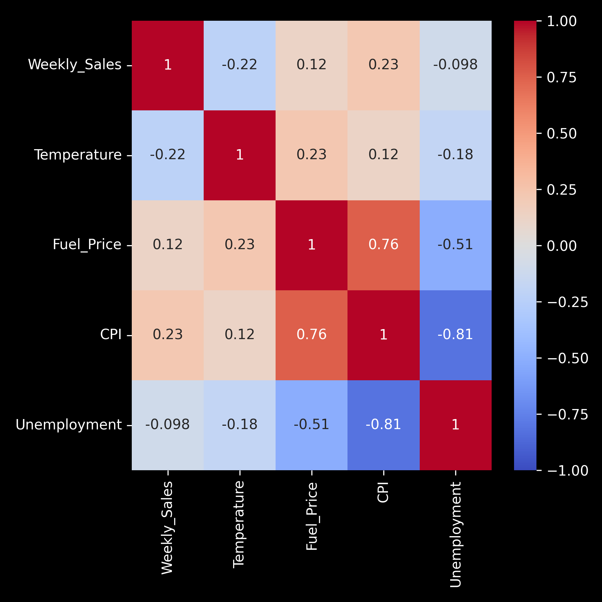
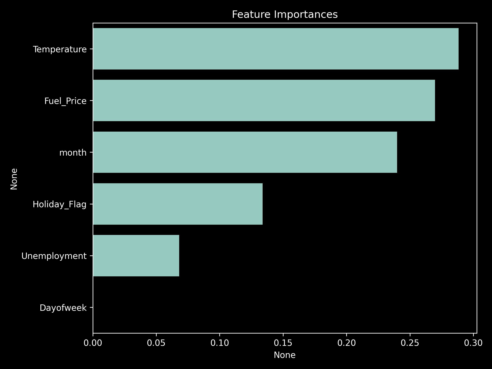

# **Grocery Sales & Demand Forecast Analysis**

Forecasting weekly grocery demand to optimize staffing and reduce stockouts.  
This project demonstrates end-to-end retail analytics: from EDA and feature engineering to modeling and actionable operations insights.

---

## **Business Problem**
Grocery retailers face volatile weekly demand, causing stockouts, overstaffing, and waste.  
**Goal:** Predict weekly sales (product/store level) to inform inventory and workforce planning.

**Potential Impact**
- Reduce stockouts and waste, improve inventory turnover
- Align staffing with demand peaks; reduce overtime
- Support promo and seasonality planning

---

## **Data**
- **Source:** `grocery.csv`
- **Grain:** Weekly × (Store, Product) *(as available)*
- **Key Fields:** `Date/Week`, `Store`, `Product`, `Category`, `Price`, `Promo_Flag`, `Weekly_Sales`, …

---

## **Methods**
1. **EDA** — trends, seasonality, correlation diagnostics  
2. **Feature Engineering** — lags, rolling stats, promo/price features  
3. **Models** — Linear Regression, RandomForestRegressor  
4. **Evaluation** — MAE, R² (train/test), error distribution  
5. **Ops Insights** — stockout/overstock risk cues, weekly deviation vs. plan

---

## **Key Visuals**





---

## **Results**
- **Model(s):** Linear Regression, Random Forest
- **Metrics:**  
  - **MAE (train/test):** *e.g.,* 12,340 / 13,210  
  - **R² (train/test):** *e.g.,* 0.81 / 0.78
- **Findings:** Price/promo sensitivity high in short-term; specific categories show large weekly variance; external factors (e.g., CPI/unemployment) weak-to-moderate correlation depending on store.

---

## **Business Recommendations**
- **Inventory:** Raise safety stock for high-variance SKUs; trim for consistently stable SKUs  
- **Staffing:** Shift schedules toward weekly peaks; add pre-promo coverage  
- **Pricing/Promo:** Use elastic SKUs for demand shaping; avoid stacking promos on already volatile items

---

## **Tech Stack**
**Python**: pandas, scikit-learn, matplotlib/seaborn, statsmodels  
**ML**: Linear Regression, RandomForestRegressor  
**Metrics**: MAE, R²

---

## **How to Run**
```bash
# 1) clone
git clone https://github.com/<your-username>/grocery-sales-forecast.git
cd grocery-sales-forecast

# 2) open the notebook (ensure Python 3.10+)
# pip install -r requirements.txt  # (optional: if you add one)

# 3) export figures inside notebook cells
# e.g., save_fig("weekly_sales_trend")
