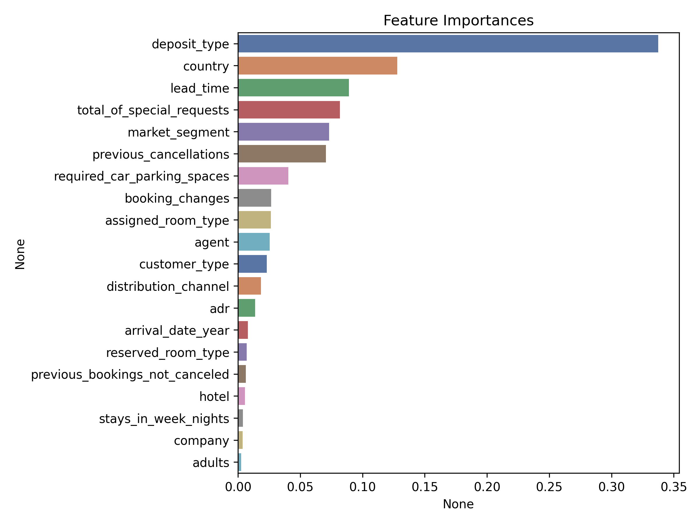

# **Hotel Booking Demand Analysis**

This project analyzes hotel booking data to detect patterns in booking behavior and predict cancellations and no-shows.  
By combining EDA, segmentation, and machine learning, it aims to help hotel operators reduce revenue loss from unfulfilled reservations.

---

## **📌 Project Overview**

- **Goal:** Predict booking cancellations and no-shows to optimize hotel operations and improve profitability.
- **Data Source:** [Kaggle - Hotel Booking Demand](https://www.kaggle.com/datasets/jessemostipak/hotel-booking-demand)
- **Project Type:** Exploratory Data Analysis + Predictive Modeling
- **Tools Used:** Python (Pandas, Scikit-learn, Seaborn, Matplotlib)

---

## **🏨 Business Scenario**

Hotel A suffers from a rising number of **no-shows**, causing unrecoverable room revenue loss.  
To address this, the hotel aims to build a system that forecasts **high-risk reservations** and enables preemptive cost control strategies.

> **Problem:** Rising operational costs from cancellations and no-shows  
> **Solution:** Predictive model for cancellation likelihood  
> **Impact:** Mitigate losses by overbooking or reallocating rooms in advance  

---

## **🔍 Analysis Process**

### 1. Data Cleaning & Preprocessing
- Removed outliers and missing values
- Created derived features such as total guests, special requests count, etc.

### 2. Exploratory Data Analysis (EDA)
- **Monthly booking trends** revealed seasonal demand peaks in July–August.
- Higher cancellation rates were found for **City Hotel**, especially for longer lead times.
- **Repeat guests** and those with **special requests** showed lower cancellation probabilities.

### 3. Modeling No-Show Predictions
- Trained Random Forest Classifier (max_depth=6) to predict reservation status.
- Key features included: `lead_time`, `previous_cancellations`, `total_of_special_requests`, and `booking_changes`.

> **Test Set Performance:**  
> Accuracy **0.78**, Precision(1) **0.96**, Recall(1) **0.44**, F1(1) **0.60**

---

## **🎯 Key Takeaways**

- **Long lead time** and **previous cancellation history** are strong signals of no-show risk.
- **High special request count** typically indicates committed customers.
- By flagging reservations with high cancellation risk, hotels can implement **overbooking strategies** or proactive follow-ups to improve occupancy rates.

---

## **📁 Repository Structure**

