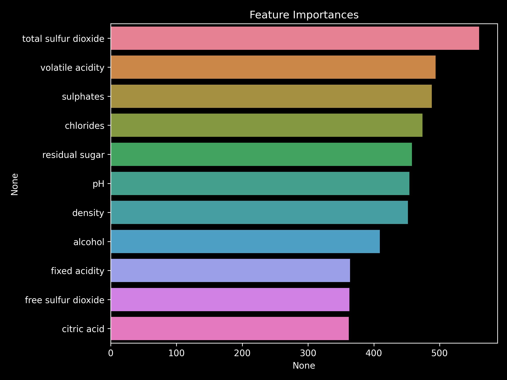

# **Factor Analysis for Quality Control (Wine Quality)**

This project identifies and quantifies the process variables most influential in determining wine quality.  
By combining exploratory data analysis, statistical modeling, and interpretability techniques, it delivers actionable insights for manufacturing process optimization.

---

## **Business Problem**
The winery aims to increase the proportion of products rated **7 or above** while reducing waste and rework.  
**Goal:** Determine which measurable process parameters most strongly influence the final quality score, and build a predictive model to support quality control decisions.

**Potential Impact**
- Increase high-quality output by prioritizing top predictive variables
- Reduce operational costs by focusing process control on high-leverage factors
- Inform targeted interventions during production to improve batch outcomes

---

## **Data**
- **Grain:** Batch-level chemical and physical measurements with a final **quality** score
- **Key Features:** fixed acidity, volatile acidity, citric acid, residual sugar, chlorides, free/total sulfur dioxide, density, pH, sulphates, alcohol, quality (target)

---

## **Methods**
1. **Exploratory Data Analysis** – correlation heatmap, scatterplots of quality vs. key variables  
2. **Feature Engineering** – scaling and transformation of continuous predictors  
3. **Modeling** – Multiple Linear Regression for interpretability  
4. **Evaluation** – MAE, R² (train/test), and error distribution analysis  
5. **Explainability** – model coefficients to assess directional influence of each feature

---

## **Key Visuals**

---

## **Results**
- **Model:** Multiple Linear Regression
- **Performance Metrics:**  
  - **MAE (train/test):** 0.57 / 0.58  
  - **R² (train/test):** 0.28 / 0.27  
  - *(Rounded prediction scenario)* MAE (test) 0.53, R² (test) 0.16
- **Key Drivers:**  
  - **alcohol** ↑ → quality score increases  
  - **volatile acidity** ↑ → quality score decreases  
  - **density** (above threshold) ↑ → quality score decreases  
- **Notes:** Certain variables exhibit multicollinearity, leading to coefficient instability and limiting causal interpretation.

---

## **Business Recommendations**
- Tighten process controls on the **top 3 influencing variables** (e.g., alcohol content, volatile acidity, density)  
- Introduce intermediate QC checks focused on reducing volatile acidity during fermentation  
- Maintain alcohol levels within the optimal range for the premium product line (≥7 rating target)

---

## **Tech Stack**
**Python**: pandas, scikit-learn, matplotlib, seaborn  
**Models**: Multiple Linear Regression  
**Metrics**: MAE, R²

